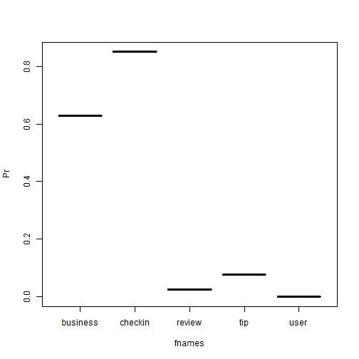

## Introduction  

The purpase of this project is analysis of received data to see how many the same data types in this the real data bases structure.
The first task is the reseiving data by the next codes lines:

```r
fnames <- c('business','checkin','review','tip','user')
jfile <- paste0(getwd(),'/yelp_academic_dataset_',fnames,'.json')
dat <- llply(as.list(jfile), function(x) stream_in(file(x),pagesize = 10000))
names(dat) <- fnames
save.image(paste0(getwd(),'/Capstone_Quiz.RData'))
```
For the future job with this data this R session was saved in *Capstone_Quiz.RData* for load it an any time:

```r
load(paste0(getwd(),"/Capstone_Quiz.RData"))
```

--- .class #id

## Methods and Data  
Now lets looking for each files names into this data base

```r
fnames <- c('business','checkin','review','tip','user')
Names<-sapply(fnames, function(x) names(dat[[x]]))
```
Now lets look how often the same data's name includes to this data bases  

```r
vec_Names<-unlist(Names, recursive = TRUE)
sort(table(vec_Names),decreasing = TRUE)
```
At the first position name "type", but data with this name are different for each data base. So, lets analyse data with name at the second position  - *business_id*

```r
load(paste0(getwd(),"/Capstone_Quiz.RData"))
b<-intersect(dat$business$business_id,dat$checkin$business_id)
b<-intersect(b,dat$review$business_id);b<-intersect(b,dat$tip$business_id)
Pr<-sapply(fnames,function(x){length(b)/length(dat[[x]]$business_id)})
PrD<-data.frame(fnames,Pr)
```

--- .class #id

## Results 

Here we can see that there are the same data named *"business_id"* at all data files.  

The percent of replied data for each data file we can see on figure below:  

 


--- .class #id

## Discussion 

From this small investigation we can see how many the same data in this big data base there are.

We see that the structure of theese files unisotropted and in the differen files we can see different percent of the same data

File named *"checkin"* has the most equial data

File named *"user"* hasn't any equial data at all

